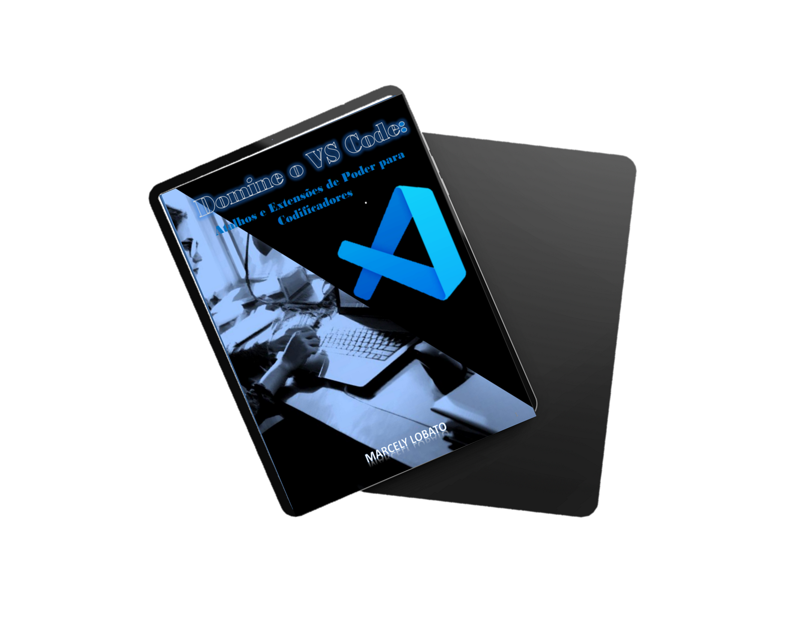

# Projeto E-book criado por IA

 > ℹ️ **NOTE:** Este é o repositório desenvolvido durante o BootCamp Santander  2024 com o querido Felipe Aguiar,instrutor técnico na plataforma da [DIO](https://dio.me).

 

 Projeto com o objetivo de gerar um ebook digital com as facilidades das ferramentas de IA. todos os prompts seguem abaixo.

________________________

# 💻 Tecnologias utilizadas no projeto

- [ChatGPT](https://chat.openai.com/) 
- [MidJourney](https://www.midjourney.com/app/)
- [PowerPoint](https://www.microsoft.com/en/microsoft-365/powerpoint)
## 🧠 Prompts
ChatGPT：
|   Ação   | prompt                                                                                                                                                                                                                                                                         |
| :------: | ------------------------------------------------------------------------------------------------------------------------------------------------------------------------------------------------------------------------------------------------------------------------------ |
|  título  | Crie um título de um ebook sobre o tema de css, o ebookk é do nicho de programação e o subnicho é de css, o título deve ser épico e curto, e tenha uma temática de star wars no título, me liste 5 variações de títulos                                                        |
| conteúdo | Faça um texto para ebook , com foco em CSS, listando os principais seletores CSS com exemplos em código {REGRAS} Explique sempre de uma maneira simples Deixe o texto enxuto, Sempre traga exemplos de código em contextos reais , sempre deixe um título sugestivo por tópico |
Midjourney：
|  Ação  | prompt                                                                                 |
| :----: | -------------------------------------------------------------------------------------- |
| título | A maldivian woman software developer at work   |

## 👨‍💻 Gestão de TI |  Desenvolvedora Front-End

    
    
&nbsp&nbsp&nbspMArcely Lobato 
    &nbsp&nbsp&nbsp
    <a href="https://github.com/marcelylobato">
    GitHub</a>&nbsp;|&nbsp;
    <a href="www.linkedin.com/in/
marcely-lobato">LinkedIn</a>
&nbsp;|&nbsp;
    <a href="https://www.instagram.com/marcely.lobato/">
    Instagram</a>
&nbsp;|&nbsp;

  

---

⌨️ com 💜 por [Marcely Lobato](https://github.com/marcelylobato)